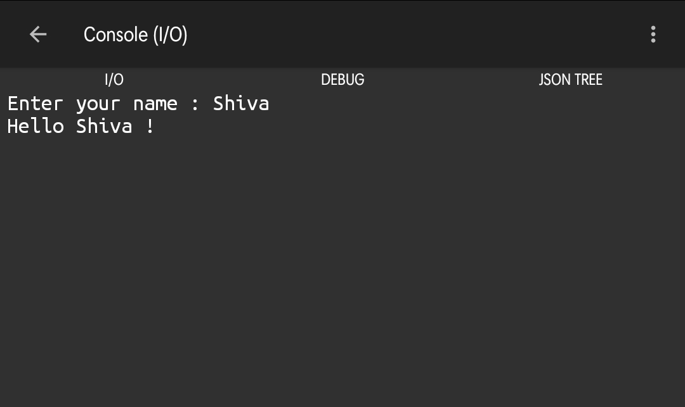

# C#

> Program :

```cs
using System;
using System.IO;
using System.Linq;
using System.Collections.Generic;

namespace CSharp_Shell{
    public class Program {
        public static void Main(){
            Console.Write("Enter your name : ");
            String name = Console.ReadLine();
            Console.WriteLine("Hello " + name + " !");
        }
    }
}
```

> OutPut :


